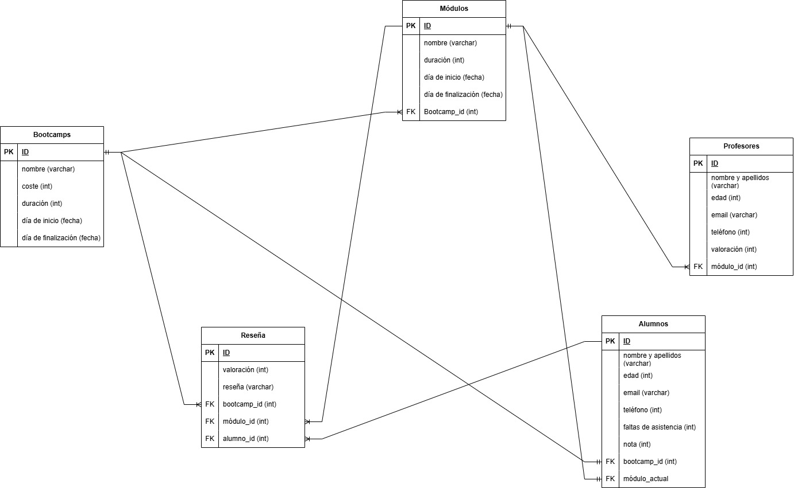

# SQLpractice
## Marcos Gutierrez Moya

# 1) CREAR DIAGRAMA ENTIDAD RELACIÓN
Realizar el diagrama entidad relación con el que poder modelar una base de
datos para Keepcoding, es decir, recogiendo datos de alumnos, bootcamps,
módulos, profesores...
Se debe entregar un pdf con el diagrama y una pequeña explicación de este.

# 2) CREACIÓN DE BASE DE DATOS
Desarrollar un script para crear las tablas y las restricciones necesarias según el
diagrama entregado en el punto anterior.
El script debe poder ejecutarse en PostgreSQL.
Se debe entregar un fichero con el código solicitado y extensión .sql

[Enlace al ejercicio](./Ejercicio2_CrearTablas.sql)

# 3) CREAR TABLA DE ivr_detail
Queremos tener los siguientes campos:
- calls_ivr_id
- calls_phone_number
- calls_ivr_result|
- calls_vdn_label
- calls_start_date
- calls_start_date_id
- calls_end_date
- calls_end_date_id
- calls_total_duration
- calls_customer_segme
- calls_steps_module
- calls_module_aggregation
- module_sequece
- module_name
- module_duration
- module_result
- step_sequence
- step_name
- step_result
- step_description_error
- document_type
- document_identification
- customer_phone
- billing_account_id

[Enlace al ejercicio](./Ejercicio3_ivr_detail.sql)
> Para no usar el nombre del dataset, habría que crear una view.

# 4) Generar el campo vdn_aggregation
- Si vdn_label empieza por ATC pondremos FRONT
- Si empieza por TECH pondremos TECH
- Si es ABSORPTION dejaremos ABSORPTION
- Si no es ninguna de las anteriores pondremos RESTO.

[Enlace al ejercicio](./Ejercicio4_vdn_aggregation.sql)

# 5) Generar los campos document_type y document_identification
Queremos tener un registro por cada llamada y un
sólo cliente identificado para la misma.

[Enlace al ejercicio](./Ejercicio5_DocumentInformation.sql)

# 6) Generar el campo customer_phone
Un sólo cliente identificado para la misma

[Enlace al ejercicio](./Ejercicio6_customerPhone.sql)

# 7) Generar el campo billing_account_id
Identificar al cliente en alguno de los pasos de detail
obteniendo su número de cliente.

[Enlace al ejercicio](./Ejercicio7_billing_id.sql)

# 8) Generar el campo masiva_lg
Un flag que indique si la llamada ha pasado por el módulo AVERIA_MASIVA.
Si es así indicarlo con un 1 de lo contrario con un 0.

[Enlace al ejercicio](./Ejercicio8_flag-averia_masiva.sql)

# 9) Generar el campo info_by_phone_lg
Un flag que indique si la llamada pasa por el step de nombre CUSTOMERINFOBYPHONE.TX y su step_result es OK.
En ese caso pondremos un 1 en este flag, de lo contrario llevará un 0.

[Enlace al ejercicio](./Ejercicio9_flag-phone.sql)

# 10) Generar el campo info_by_dni_lg
Un flag que indique si la llamada pasa por el step de nombre CUSTOMERINFOBYDNI.TX y su step_result es OK.
En ese caso pondremos un 1 en este flag, de lo contrario llevará un 0.

[Enlace al ejercicio](./Ejercicio10_flag-dni.sql)

# 11) Generar los campos repeated_phone_24H, cause_recall_phone_24H
Dos flags que indiquen si el calls_phone_number tiene una llamada las anteriores 24
horas o en las siguientes 24 horas. En caso afirmativo pondremos un 1 en estos
flag, de lo contrario llevará un 0.

[Enlace al ejercicio](./Ejercicio11_flags-24h_calls.sql)

# 12) CREAR TABLA DE ivr_summary
- ivr_id: identificador de la llamada (viene de detail).
- phone_number: número llamante (viene de detail).
- ivr_result: resultado de la llamada (viene de detail).
- vdn_aggregation: calculado anteriormente.
- start_date: fecha inicio de la llamada (viene de detail).
- end_date: fecha fin de la llamada (viene de detail).
- total_duration: duración de la llamada (viene de detail).
- customer_segment: segmento del cliente (viene de detail).
- ivr_language: idioma de la IVR (viene de detail).
- steps_module: número de módulos por los que pasa la llamada (viene de
detail).
- module_aggregation: lista de módulos por los que pasa la llamada (viene
de detail).
- document_type: calculado anteriormente.
- document_identification: calculado anteriormente.
- customer_phone: calculado anteriormente.
- billing_account_id: calculado anteriormente.
- masiva_lg: calculado anteriormente.
- info_by_phone_lg: calculado anteriormente.
- info_by_dni_lg: calculado anteriormente.
- repeated_phone_24H: calculado anteriormente.
- cause_recall_phone_24H: calculado anteriormente.

[Enlace al ejercicio](./Ejercicio12_tabla-ivr_summary.sql)

# 12) CREAR FUNCIÓN DE LIMPIEZA DE ENTEROS
Crear una función de limpieza de enteros por la que si entra un null la función
devuelva el valor -999999.

[Enlace al ejercicio](./Ejercicio12_funcion_nulls.sql)